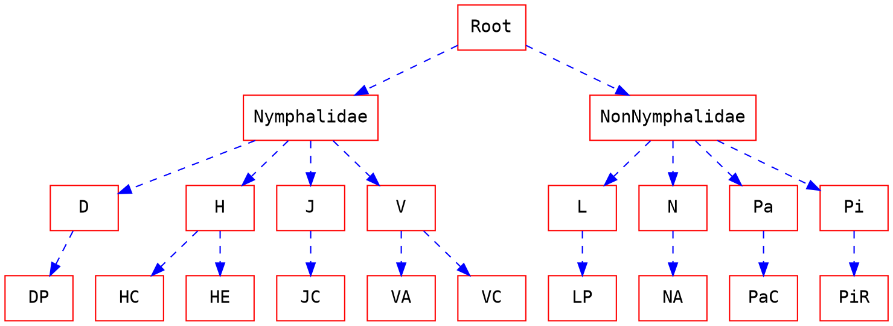

# hi_fgic

Hierarchical Fine-Grained Image Classification

## Package Structure
```
hi_fgic
├── __init__.py
├── img_util
│   ├── __init__.py
│   ├── segment.py
│   └── bounding_box.py
├── baseline_classifier
│   ├── __init__.py
│   ├── b_leeds_butterfly.py
│   ├── b_stanford_dogs.py
│   ├── b_cub_200.py
│   └── b_fgvc_aircraft.py
└── hi_classifier
	├── __init__.py
    ├── hi_leeds_butterfly.py
    ├── hi_stanford_dogs.py
    ├── hi_cub_200.py
    └── hi_fgvc_aircraft.py
```

## Fine Grained Image Classification

### Dataset

#### Non FG Hierarchical
- [CIFAR-100](https://www.cs.toronto.edu/~kriz/cifar.html)
- [CIFAR intro](http://corochann.com/cifar-10-cifar-100-dataset-introduction-1258.html)

#### FG Non-hierarchical
##### Small Scale
- [Leeds Butterfly](http://www.josiahwang.com/dataset/leedsbutterfly/)
Manually constructed Hierarchy (based on species)
```
Super Class (Family)
0:Nymphalidae
1:NonNymphalidae

8 Super Class (Genus)
0: Danaus
1: Heliconius	
2: Junonia
3: Lycaena
4: Nymphalis	
5: Papilio	
6: Pieris	
7: Vanessa

10 FG classes (Species)
001: Danaus plexippus
002: Heliconius charitonius	
003: Heliconius erato	
004: Junonia coenia	
005: Lycaena phlaeas
006: Nymphalis antiopa	
007: Papilio cresphontes	
008: Pieris rapae	
009: Vanessa atalanta	
010: Vanessa cardui
```



##### Medium scale
- [Stanford Dog](http://vision.stanford.edu/aditya86/ImageNetDogs/)
- [CUB-200-2011](http://www.vision.caltech.edu/visipedia/CUB-200-2011.html)
- [FGVC Aircraft](http://www.robots.ox.ac.uk/~vgg/data/fgvc-aircraft/)
- 

### B-CNN
[Github](https://github.com/zhuxinqimac/B-CNN)
[Project Webpage](http://zhuxinqi.space/project/content.php?timestamp=201709)


